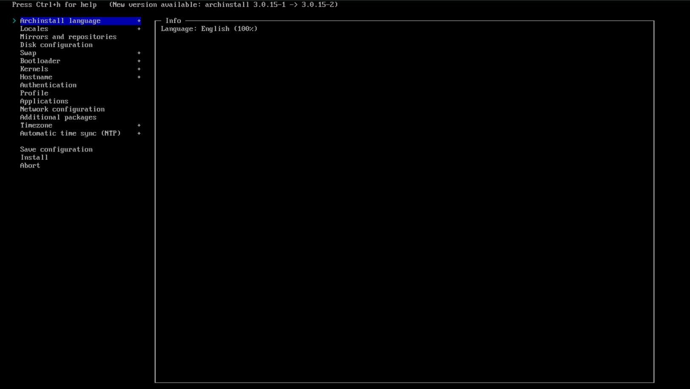
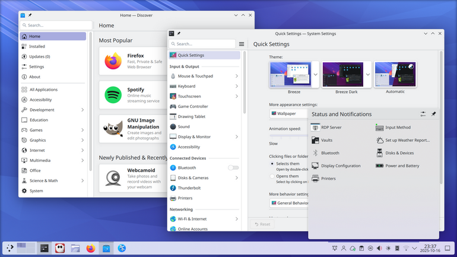

### Arch Linux: Instalação Encriptada

No post anterior eu falei exclusivamente do secureboot, então fica em aberto toda a minha instalação do Arch Linux. Vou começar com um pequeno resumo da minha trajetória no Linux.

Em resumo, eu venho de um longo caminho do termo chamado: [Distro-Hopping](https://informatecdigital.com/pt/O-que-%C3%A9-%22distro-hopping%22-no-Linux--por-que-e-quando-faz%C3%AA-lo/). Claro que nunca considerei isso um problema, mas foi exatamente por isso que cheguei até aqui. Testando distros todos os dias, fazendo backup dos meus dados, migrando para outra distro... já cheguei a trocar de distro 4x no dia. Ficava o tempo todo acompanhando o [DistroWatch](https://distrowatch.com/), gostava de testar várias distros, sempre gostei de novidades e software bem atualizado. Foi quando encontrei a distro [Manjaro](https://manjaro.org/), com a promessa de ser uma distro [Rolling release](https://meulinux.com.br/rolling-release-linux/).

Eu, que não entendia nada sobre esse tipo de distro, fiquei muito curioso e logo coloquei na minha máquina. Aquilo despertou uma curiosidade muito grande, eu queria ter o gostinho de saber como funciona. Fuçando em fóruns, achei o famoso termo "I USE ARCH, BTW". Pensei comigo: que diabos é isso? Existe toda uma comunidade de defensores dessa distro maravilhosa (aparentemente me tornei um deles). Essa distro é curiosa demais, você mesmo tem que configurar tudo, nada vem pronto, nem mesmo o ambiente gráfico. Eu gostei bastante, me fez estudar a fundo o Linux e ter todo o conhecimento que tenho hoje.

Deixando bem claro que isso não é um tutorial — tem muitos pela internet, basta só pesquisar ou seguir a [Arch Wiki](https://wiki.archlinux.org/title/Installation_guide) — estou relatando a minha instalação e isso pode ajudar outras pessoas.

Antes de me criticarem, deixo claro que eu não ligo para o que pensam. Eu uso o script [archinstall](https://wiki.archlinux.org/title/Archinstall) e incentivo o uso; facilita e agiliza a vida de todos. Gosto bastante do trabalho que estão fazendo com ele, até já contribuí algumas vezes. Se você é o chato que gosta de esfregar na cara que instalou tudo manualmente, parabéns! Significa que você sabe ler o manual.

### O Processo (Direto ao Ponto)

A instalação com o `archinstall` é bem simples. Você digita `archinstall` e dá enter; aparecerá um menu interativo pelo terminal.

Daí em diante é só seguir a ordem do menu. O segredo para a minha configuração segura e robusta está nos detalhes abaixo. Não tem mistério, mas tem que prestar atenção para não fazer besteira.

#### 1. Layout de Disco e Criptografia

Aqui é onde a mágica acontece. Eu não deixo meus dados expostos, então a encriptação é obrigatória.

- **Disk Configuration:** Seleciono o disco principal.
- **Particionamento:** Escolho o layout automático ("Best-effort default partition layout").
- **Disk Encryption:** Ativo essa opção e defino uma senha para o **LUKS** (Não preciso nem falar pra você não usar o nome do cachorro como senha ne!) . Essa senha é a que vai liberar o sistema no boot. Não a perca, se não você se ferra.
- **LVM:** Garanto que o particionamento esteja usando **LVM**. Isso me dá flexibilidade para redimensionar volumes no futuro se precisar.

#### 2. Bootloader

Eu sou do time **[GRUB](https://wiki.archlinux.org/title/GRUB)**. O systemd-boot é legal, bem minimalista, mas o GRUB é meu companheiro a muito tempo e eu já estou acostumado com ele.

- No menu de Bootloader, mudo a seleção padrão para `grub`.

#### 3. Sistema de Arquivos e Snapshots

Como mencionei, eu tenho uma paranoia por segurança. Se uma atualização quebrar tudo (Nunca me aconteceu, não com atualização, por burrice minha), eu quero voltar no tempo.

- **Filesystem:** Escolho **[Btrfs](https://wiki.archlinux.org/title/Btrfs)**. (A opção de compressão do btrfs me surpreende demais)
- **Snapshots:** Com o Btrfs selecionado, No `archinstall` eu configuro o suporte a snapshots. Escolhendo o **[Snapper](https://wiki.archlinux.org/title/Snapper_(Portugu%C3%AAs))**.

#### 4 Usuário e Permissões

Não adianta criptografar o disco e deixar a porta aberta.

- **Root Password:** Defina uma senha forte para o root.
- **User Account:** Crie seu usuário pessoal aqui. Nada de ficar usando root no dia a dia. O script vai perguntar se você quer adicionar esse usuário ao grupo `wheel` (para usar o comando sudo). A resposta é **sim**.
#### 5. Interface Gráfica e Vídeo

Aqui é onde o sistema ganha vida. Eu não tenho paciência para configurar gerenciador de janelas na unha, ja usei hyprland, isso me trouxe muita dor de cabeça e eu nunca estudava, ficava apenas configurando o hyprland, então vou no garantido e funcional.

- **Profile:** Entro em "Desktop" e escolho **[KDE Plasma](https://kde.org/plasma-desktop/)**. É a minha escolha: leve, moderno e me deixa personalizar cada parte do seu layout se eu quiser.
- **Graphics Drivers:** Como meu hardware é **AMD**, a vida é muito mais fácil. Seleciono a opção **AMD / ATI (open-source)**. O suporte é nativo e excelente, sem aquela dor de cabeça de drivers proprietários.
#### 6. Rede e Finalização

Como no Arch você precisa configurar tudo, lembre-se de escolher a configuração de rede adequada para você.

- **Network:** Geralmente uso o **NetworkManager**. É instalar e esquecer, funciona bem tanto para internet cabeada quanto para Wi-Fi.

Depois de revisar tudo, é só mandar instalar. O script faz o trabalho sujo, configura o `mkinitcpio` para lidar com a criptografia, gera o `fstab` e instala o bootloader. Quando terminar, reinicie, digite sua senha do LUKS e seja feliz com seu Archlinux instalado.